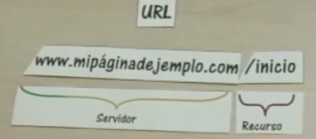
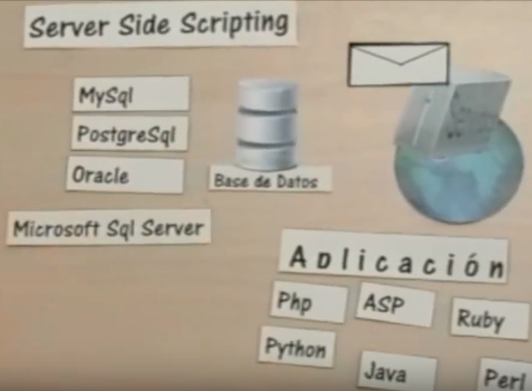
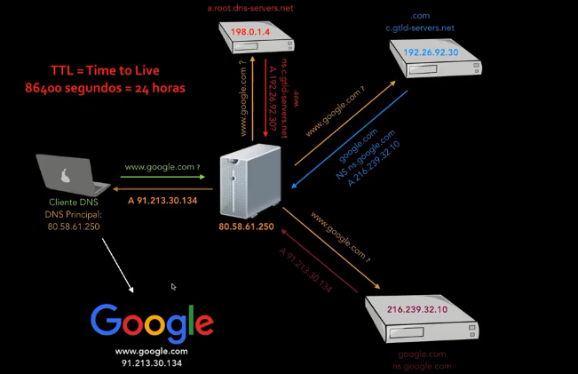

# Componentes de la web

## Internet (Red de redes)

Red de computadoras que se encuentran interconectadas a nivel mundial para compartir información. Esta red ofrece diversos servicios a sus usuarios, como pueden ser el correo electrónico, el chat o la web. Estos servicios son llevados a cabo gracias a miles de ordenadores que están permanentemente encendidos y conectados a la red, esperando que los
usuarios les soliciten los servicios y sirviéndolos una vez son solicitados.

### ¿Cómo funciona?
Para interconectar computadoras con el mundo hacen falta 2 aparatos esenciales un router y un modem.

- Router (Cables) que es una pequeña computadora que asegura que el mensaje enviado desde una computadora llegué la computadora destinataria correcta.

- Modem (Red telefónica, se conecta al mundo) Este aparato convierte la información de nuestra red en información manejable por infraestructura telefónica y vice versa.

## World wide web

Nace a principios de los años 90 en Suiza. Es un sistema de distribución de documentos de hipertexto, su función es ordenar y distribuir la información que existe en internet.

Introduce un concepto fundamental: La posibilidad de lectura universal, que consiste en que una vez que la información esté disponible, se pueda acceder a ella desde cualquier ordenador, desde cualquier país, por cualquier persona autorizada, usando un único y simple programa.

La Web se basa en hipertextos.

Un hipertexto es un documento que puede contener uno o varios nodos que están compuestos por distintos tipos de objetos digitales,
no solo contiene datos, sino que además contiene enlaces a otros documentos.

* Funcionamiento

Navegador -> URL -> Peticion HTTP -> Servidor ->Respuesta HTTP -> Navegador (DOM - JS - CSS) -> Pantalla

## Componentes de la web
- Cliente (Nuestro navegador)

El cliente es una aplicación informática o un ordenador que consume un servicio remoto en otro ordenador conocido como servidor, normalmente a través de una red de telecomunicaciones.

Uno de los clientes más utilizados, sobre todo por su versatilidad, es el navegador web. Este es un software, aplicación o programa que permite el acceso a la Web, interpretando la información de distintos tipos de archivos y sitios web para que estos puedan ser visualizados.

- Servidores

Un servidor web es una computadora que aloja uno o mas sitios web.

La principal función de un servidor Web es almacenar los archivos de un sitio y emitirlos por Internet para poder ser visitado por los usuarios. Básicamente, un servidor Web es una gran computadora que guarda y transmite datos vía el sistema de redes llamado Internet. Cuando un usuario entra en una página de Internet, su navegador se comunica  con el servidor enviando y recibiendo datos que determinan qué es lo que ve en la pantalla. Por eso, decimos que los servidores Web están para almacenar y transmitir datos de un sitio según lo solicita el navegador de un visitante.

 Cuando deseas ver un sitio Web, tu móvil, PC o tableta envía un pedido desde tu dirección de IP hacia la dirección IP del servidor (DNS) que aloja los archivos del sitio en cuestión. Entonces, el servidor Web responde devolviendo los datos a la dirección IP solicitante. Esto es lo que pasa todo el tiempo que estamos navegando un sitio en Internet.
 
 DNS : Sistema de nombres de dominio es una tecnología basada en una base de datos que sirve para resolver nombres en las redes, es decir, para conocer la dirección IP de la máquina donde está alojado el dominio al que queremos acceder.
 
 
 
- HTTP (Hypertext Transfer Protocol, ‘protocolo de transferencia de hipertextos’)

Es el protocolo de comunicación que permite las transferencias de información en la World Wide Web.

Un protocolo es un método por el cual dos ordenadores acuerdan comunicarse, una especificación que describe cómo los ordenadores hablan el uno al otro en una red.

El estándar HTTP/1.0 recoge únicamente tres comandos, que representan las operaciones de recepción y envío de información y chequeo de estado:

* GET Se utiliza para recoger cualquier tipo de información del servidor.

* HEAD Solicita información sobre un objeto (fichero): tamaño, tipo, fecha de modificación… Es utilizado por los gestores de cachés de páginas o los servidores proxy, para conocer cuándo es necesario actualizar la copia que se mantiene de un fichero.

* POST Sirve para enviar información al servidor, por ejemplo los datos contenidos en un formulario

- Buscador 

Un buscador es un tipo especial de sitio web que ayuda a los usuarios a encontrar páginas web de sitios web.

Hay muchos por ahí: Google, Bing, Yandex, DuckDuckGo,y muchos mas.

Muchos  motores de búsqueda con navegadores. Aclaremos esto: Un navegador es una parte de software que devuelve y muestra páginas web; un buscador es un sitio web que ayuda a las personas a encontrar páginas web de otros sitios web.

Motores de búsqueda Web funcionan mediante el envío de una araña.

Las arañas (también llamadas "spiders") de los motores de búsqueda, recorren las páginas recopilando información sobre los contenidos de las páginas. Cuando se busca una información concreta en los buscadores, ellos consultan su base de datos y presentan resultados clasificados por su relevancia para esa búsqueda concreta.

- Página web

Una página web es un documento que puede ser mostrado por un browser. Estos documentos están escritos en lenguaje HTML

Todas las páginas web disponibles en la red son accesibles mediante una dirección única. Para acceder a una página, simplemente escribe su direcciones en la barra de búsqueda de tu navegador:

## HTML

HTML no es un lenguaje de programación, HTML es un lenguaje de marcado de hipertexto o “HyperText Markup Language” básicamente este lenguaje se escribe en su totalidad con elementos, estos elementos están constituidos por etiquetas, contenido y atributos.

HTML es un lenguaje que interpreta el navegador web para mostrar los sitios o aplicaciones web tal y como estamos acostumbrados. 

HTML5 (HyperText Markup Language, versión 5) es la quinta revisión importante del lenguaje básico de la World Wide Web.

HTML5 establece una serie de nuevos elementos y atributos que reflejan el uso típico de los sitios web modernos. Algunos de ellos son técnicamente similares a las etiquetas 
 y , pero tienen un significado semántico, como por ejemplo <nav> (bloque de navegación del sitio web) y <footer>.
 
* Incorpora etiquetas (canvas 2D y 3D, audio, vídeo) 

* Añade etiquetas para manejar la Web semántica (Web 3.0): header, footer, article, nav, time (fecha del contenido)

* API de Geolocalización para dispositivos que lo soporten.

