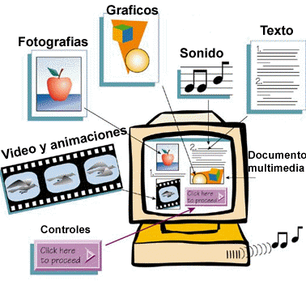

# Componentes de la web

## Internet

## World wide web

Nace a principios de los años 90 en Suiza. Es un sistema de distribución de documentos de hipertexto, su función es ordenar y distribuir la información que existe en internet.

Introduce un concepto fundamental: La posibilidad de lectura universal, que consiste en que una vez que la información esté disponible, se pueda acceder a ella desde cualquier ordenador, desde cualquier país, por cualquier persona autorizada, usando un único y simple programa.

La Web se basa en hipertextos.

Un hipertexto es un documento que puede contener uno o varios nodos que están compuestos por distintos tipos de objetos digitales,
no solo contiene datos, sino que además contiene enlaces a otros documentos.

* Funcionamiento

Navegador -> URL -> Peticion HTTP -> Servidor ->Respuesta HTTP -> Navegador (DOM - JS - CSS) -> Pantalla

## Componenetes de la web
- Cliente (nuestro navegador)
- Servidores
- HTTP
- Buscador 
- Página web

## HTML

